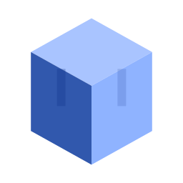
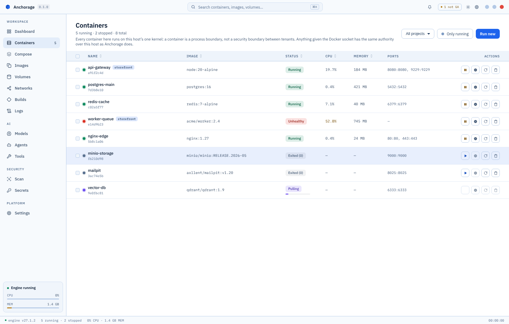
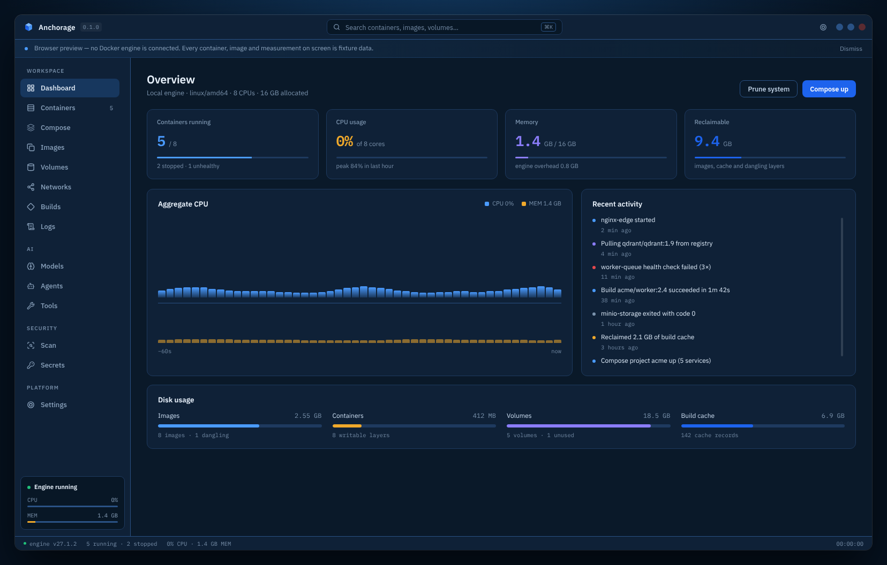
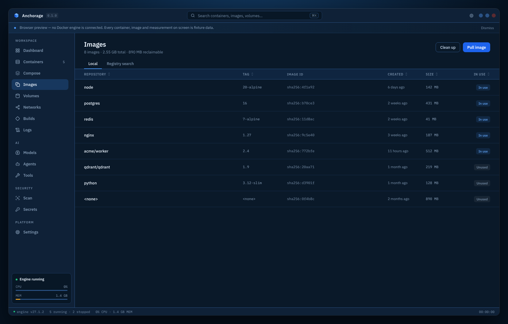
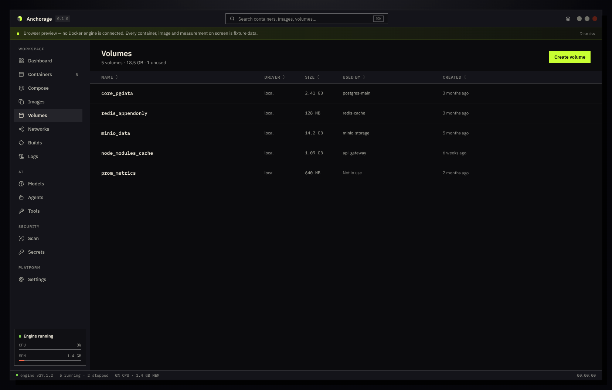
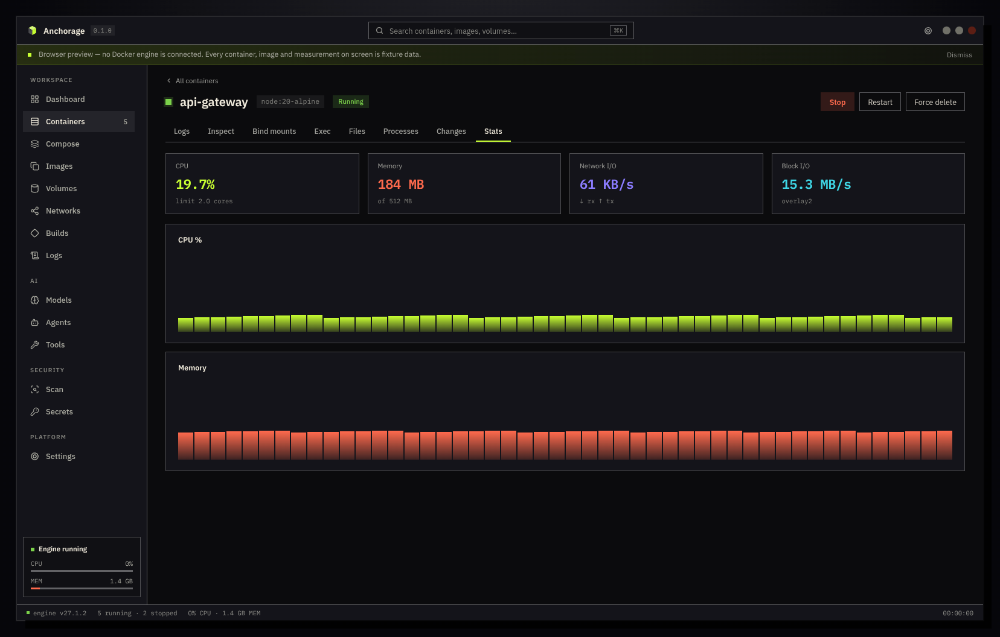
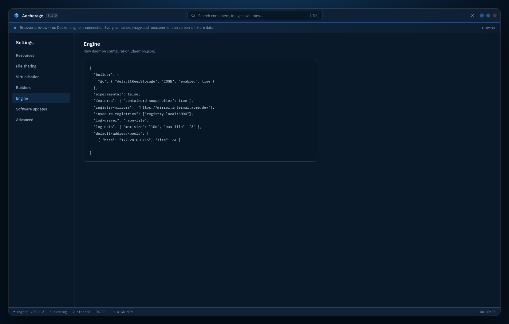

<div align="center">



# Anchorage

**A desktop app for the Docker you already have.**




<sub>Containers in Docker Light. A fresh install opens on Docker Dark, which is what the shots further down show.</sub>

</div>

> **Every screenshot here is real, and every container in them is invented.**
> They come from the design gate's own capture harness, rendered against fixture
> data so the images can be published without showing anybody's actual
> infrastructure.

---

## What this is

Docker on Linux is excellent and almost entirely invisible. Everything runs, and
nothing shows you what is running until you type a command and read a table.

Anchorage is a window onto that. It talks to the Docker daemon already on your
machine, using your existing contexts, credentials and CLI plugins. It does not
install Docker, ship its own copy, or run a virtual machine.

If something works in your terminal, Anchorage can show it. If it does not,
Anchorage says so instead of pretending.

**It is a viewer and an operator, not a replacement.** Every action becomes the
same Engine API call or the same `docker` command you would have typed yourself.

## The one idea worth knowing

**Anchorage never invents an answer.**

When a capability is missing, unreachable, or genuinely impossible on your
machine, the screen tells you which of those it is, in those words. No
placeholder data. No button greyed out in the hope you move on. No action
offered that it cannot carry out.

That sounds small. It is the thing that decides whether a tool is worth trusting
at 2am, and it is why several features in *What it deliberately does not do* were
removed rather than faked.

---

## What it does

### Containers, and what is inside them

| | |
|---|---|
| **Containers** | Live list with CPU and memory. Start, stop, restart, pause, kill, rename, change resource limits, act on many at once |
| **Container detail** | Logs, inspect, mounts, an interactive shell, running processes, filesystem changes, live stats |
| **Files** | Browse a container's filesystem, read a file, upload into it |
| **Ports** | Republish a stopped or paused container's ports. Docker fixes bindings when a container is created, so Anchorage replaces the container — and says that is what it is doing |

### Everything around them

| | |
|---|---|
| **Compose** | Projects, their services, the fully resolved configuration, and up / down / restart |
| **Images** | Local images, registry search, pull, push, tag, save, load, and a prune that shows what it will reclaim before you agree |
| **Volumes** | Browse a volume's filesystem, back up and restore to a tar archive, clone, empty, remove |
| **Networks** | List, inspect, create, remove |
| **Builds** | BuildKit build history, and the builders behind it — including repairing or deleting one that has broken |
| **Logs** | One merged, filterable stream across your running containers |
| **Scan** | Docker Scout vulnerability reports for an image |
| **Secrets** | Swarm secrets: list, create, remove. The value goes straight to the Engine API and never becomes a command argument |

### AI, where Docker actually ships it for Linux

| | |
|---|---|
| **Models** | Docker Model Runner: what is pulled, what the runner is doing, what it costs on disk. Search Docker Hub, pull, unload, remove |
| **Agents** | Chat with a model Model Runner already holds, with read-only engine tools it can use to look before it answers. Plus Docker Agent's own readiness: which models it can reach, which credentials are visible, which tool types an agent can be granted |
| **Tools** | The MCP Toolkit: browse catalogues and see, for each server, exactly which tools it would expose and which credentials it would demand |

### Two more things

**Command Center** (`Ctrl/Cmd+Shift+P`) finds and runs any command your installed
Docker CLI advertises, plugins included. It shows the exact command line before
running it, warns you before a destructive one, and masks secrets in both
arguments and environment variables.

**Capabilities** installs the CLI plugins Docker publishes a Linux binary for. The
download is checked against the SHA-256 that release states and written to your
own plugin directory — no root needed.

### What it looks like

<table>
<tr>
<td width="50%"><br><sub><b>Dashboard</b> — what the engine is doing right now</sub></td>
<td width="50%"><br><sub><b>Images</b> — local images and what is reclaimable</sub></td>
</tr>
<tr>
<td width="50%"><br><sub><b>Volumes</b> — click one to browse its filesystem</sub></td>
<td width="50%"><br><sub><b>Container detail</b> — live CPU, memory, network and disk</sub></td>
</tr>
</table>



<sub><b>Settings → Engine</b> — what the daemon reports, attributed to the key it was read from, and every optional CLI plugin with its real state.</sub>

---

## What it deliberately does not do

This list matters as much as the one above. Every entry was considered and
rejected for a stated reason, not overlooked.

### Removed, because they cannot work against a plain Linux Docker Engine

| | Why |
|---|---|
| **Ask Gordon** (`docker ai`) | Needs Docker Desktop and a signed-in account. Docker publishes no standalone binary at any price |
| **Sandboxes** (`sbx`) | Needs Ubuntu 24.04+, KVM, and an OAuth sign-in |
| **Docker Cloud / Offload** | A managed cloud service behind a subscription |
| **Desktop Extensions** | A Docker Desktop-only framework. Ours used to show a marketplace of invented ratings and install counts, which is worse than having no screen at all |
| **Dev Environments** | Docker deleted this in Desktop 4.42 and archived the repository |
| **Hardened Images** | A Docker Hub catalogue with no API or CLI command to list it |
| **Governance** | Administered in a web console the engine cannot read back |
| **Kubernetes** | Needs cluster state Anchorage does not read. Desktop can offer a cluster only because it manages a virtual machine |

### Present, but bounded on purpose

- **The chat reads and cannot act.** A model on the Agents screen can list and
  inspect containers, images, volumes and networks and read logs. It cannot
  start, stop, remove or change anything, and that is the tool catalogue rather
  than the prompt — instructions describe intent, tools are the boundary.
- **Agents does not run agents.** `docker agent run` is a separate interactive
  terminal application driven by a YAML file, and stays in the terminal:
  rebuilding it would mean claiming parity with something that changes weekly.
  The chat above is a different thing — a local model answering about this
  engine, not an agent configuration being executed.
- **Tools browses but does not enable.** Adding an MCP server to a profile is one
  command away and stays a deliberate one — a mis-click hands an agent someone
  else's credentials.
- **Secrets can never show you a value.** Docker discards the plaintext the
  moment a secret exists. Nothing can read it back, so no control here pretends
  otherwise.
- **Anchorage does not update itself.** Nothing contacts a server or installs
  anything in the background. You verify a release by hand — see below.
- **Linux only.** Packaged as an AppImage, `.deb`, `.rpm` and `.pacman`, for
  x86-64 and arm64. There is no macOS or Windows build.

---

## How it is built

Three parts, deliberately kept apart:

```
┌──────────────────────┐
│  Renderer            │  React + TypeScript. Sandboxed, no Node access,
│  what you see        │  no filesystem, no network, no Docker socket.
└──────────┬───────────┘
           │  a fixed list of validated IPC channels
┌──────────┴───────────┐
│  Electron main       │  Validates every request against the protocol
│  the gate            │  before it goes further. Blocks all downloads.
└──────────┬───────────┘
           │  JSON-lines over stdio
┌──────────┴───────────┐
│  Go core             │  Zero third-party dependencies. Talks to the
│  the work            │  Docker socket and runs one fingerprinted binary.
└──────────────────────┘
```

**Why a separate core.** The renderer is where untrusted text ends up — container
names, image labels, log output. Keeping every privileged operation behind a
typed protocol in a different process means a bug in the UI cannot turn into a
Docker command.

**Why the core has no dependencies.** It is the part holding the socket. A supply
chain is a decision, and this one is that there isn't one.

**Why everything is validated three times.** The preload boundary, the main
process and the core each check the same request against the same schema. That
duplication is the point: every layer refuses on its own rather than trusting the
one before it.

More detail: [docs/architecture.md](docs/architecture.md) ·
[docs/parity-and-release-gates.md](docs/parity-and-release-gates.md)

---

## Requirements

- Linux, x86-64
- A Docker daemon your user can reach — if `docker ps` works in your terminal,
  you are ready
- Docker CLI plugins are optional. They are detected when present and never
  required

For development, additionally:

- Go 1.25 or newer
- Bun 1.3 or newer
- Node.js 20.11 or newer. Bun runs the scripts; several of them run `node --test`,
  and the Go core is launched by Node in development

## Running it

```bash
go -C core build -o bin/anchorage-core ./cmd/anchorage-core
cd app
bun install
bun run dev:desktop     # development
```

The Go build is not optional and it comes first. `core/bin/` is not in the
repository — the core is a binary, so a clone does not carry one — and
`dev:desktop` launches whatever is at that path. Skip the build and the window
opens onto a backend that was never there.

Bun is the package runtime. `bun install` is what produces a working tree: the
Electron binary is not in the npm tarball and Electron 43 dropped its own
postinstall for an `install-electron` bin, so a root `postinstall` fetches it and
neither package manager gets it otherwise.

**`bun run test`, not `bun test`.** The second runs Bun's own test runner over
whatever it finds; the first runs the gate.

## Packaging

```bash
cd app
bun run package:linux
```

**This does not succeed from a clean checkout, and cannot.** `package-desktop.mjs`
refuses to build without the release evidence bundle under `artifacts/` — mutation
conformance, the capability ledger, performance results, the host-candidate
captures — and that bundle is measured against a live Docker daemon rather than
committed. The one exception is `artifacts/design/design-ledger.json`, which is
committed because it is the output of a review a machine cannot perform.

The release workflow does that generation for you, on both architectures, which is
the supported path. Locally, the first thing the build says is which file it wants:

```
[anchorage-package] Error: mutation conformance evidence is missing:
artifacts/docker/conformance-results.json
```

One command regenerates the core half, and only when it needs to:

```bash
node tools/ensure-core-evidence.mjs
```

The evidence is bound by SHA-256 to one core binary, so it is reused when it
already describes the current one and re-measured when it does not — which is
whenever any `core/**/*.go` changes. Most commits touch only the renderer, and
for those this is a few seconds rather than the forty minutes the soak costs.
`--force` measures it again regardless.

The generators it drives are in `tools/`, alongside `generate-security-evidence.mjs`
and `capture-host-candidate.mjs`, which `package:linux` runs itself.

That refusal is the design working. A packaged build is a release candidate only
once `app/release/release-verification.json` reports `"status": "passed"`, and
that receipt ties together the exact AppImage, renderer, core binary, Electron
runtime and release evidence. An electron-builder output without it is an
intermediate file, not a release — so a build that cannot prove itself does not
produce one.

## Verifying a download

Each architecture has its own checksum list, because a checksum file signed by a
machine should cover what that machine actually built:

```bash
gpg --import anchorage-signing-key.asc          # once, from this repository
gpg --verify SHA256SUMS-x64.asc SHA256SUMS-x64
sha256sum -c SHA256SUMS-x64
```

Both are stock tools. A signature that does not verify means the download is not
the release that was published, whatever the file happens to be called.

The import is not a formality, and skipping it does not merely make the check
weaker — it makes it answer a different question. `gpg --verify` on its own asks
"is this a valid signature by someone whose key I hold": on an empty keyring it
cannot answer at all and exits 2, and on a keyring holding anyone else's key it
prints `Good signature` for **their** signature over a file they chose. What you
want to know is that Anchorage signed it, so check the fingerprint gpg reports
against the one published here:

```
6EC9 EBF7 5C48 EA12 D1C5 4A7E 22E6 9E9D C856 20D3
```

Signing lives on a subkey of that primary, so `gpg` will report a different
(shorter-lived) key as the signer and name this fingerprint as its primary. That
is the expected shape: the runner that signs a release can sign, and cannot
certify a key as Anchorage.

`release-verification-<arch>.json` records what was **executed** and what was only
**inspected**. The AppImage payload is run and timed on the machine that built it;
the `.deb`, `.rpm` and `.pacman` payloads are unpacked and checked byte-for-byte
against it but never installed, because unpacking a `.deb` into a temp directory
does not exercise what a `.deb` does. The report says which is which rather than
implying they were all run.

## Continuous integration

`.github/workflows/gate.yml` runs on every push and pull request: the suite, the
strict typecheck, `go vet`, and the core tests under `-race`.

`.github/workflows/release.yml` runs on a `v*` tag. It builds one job per
architecture on a runner of that architecture — nothing is cross-compiled,
because everything the packaging claims about a package it establishes by running
it, and a foreign architecture cannot be run. Each job regenerates the core
acceptance, capability and performance evidence against a live daemon, builds and
verifies all four formats, signs if a key is configured, and the artifacts land on
a draft release.

The design evidence is the exception, and deliberately so. The comp and the
rendered reference are both untracked, and the per-state review is a person
looking at two images — so `artifacts/design/design-ledger.json` travels with the
commit and the packaging validates it against the renderer it just built. Change
the renderer without redoing the review locally and the release fails in CI. That
is the gate working, not a missing feature.

---

## Testing

```bash
cd app  && bun run test                  # the full gate
cd app  && bun run typecheck:renderer     # NOT part of the gate — run it separately
cd core && go test -race ./...
```

The gate covers more than unit tests:

- **628 renderer tests** across 49 files
- **Protocol conformance** — the JSON schema, the TypeScript types and the Go
  structs must agree, or the build fails
- **Theme integrity** — every colour is a token, and every text-on-surface pair
  clears WCAG AA in all ten theme-and-mode combinations
- **Theme fidelity** — the design handoff is in the repository and is parsed on
  every run: surfaces, lines and palette must equal it, and the two places the
  app deviates are listed by name with the reason
- **Design parity** — 21 canonical screens measured against the design comp, with
  every divergence budgeted and explained
- **Core binary freshness** — the packaged core cannot be older than its sources

## Appearance

Five theme families — Nous, Docker, GitHub, Monochrome and Magnetic — each in
light and dark, and each in rounded or square corners. A fresh install opens on
Docker Dark. Colours come from one semantic token contract rather than being
written into components, which is what makes the contrast checks above possible
at all.

## Contributing

Two conventions matter more than formatting:

1. **Comments explain why, especially why the obvious alternative was rejected.**
   A comment restating the code is noise. A comment recording a decision is often
   the most valuable thing in the file.
2. **A test states the defect it prevents.** "Checks the parser" is not a reason.
   "A naive split turns *Not Installed* into two fields and shifts every column
   left" is.

## Licence

MIT — see [LICENSE](LICENSE).

Bundled third-party components keep their own terms. Electron and Chromium ship
their notices in the package (`LICENSE.electron.txt`, `LICENSES.chromium.html`);
IBM Plex Sans and Mono are SIL OFL-1.1 and their notice is not yet shipped
alongside them, which is a known gap rather than a settled position.
