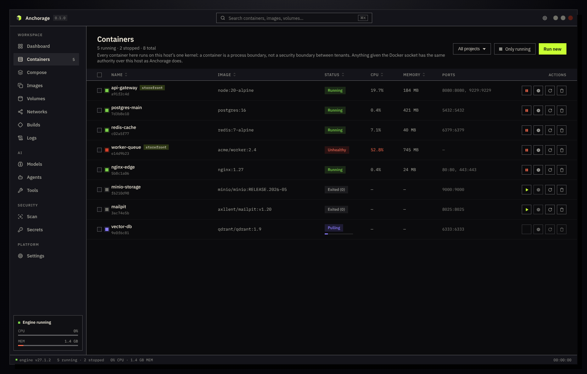

<div align="center">


# Anchorage

**A desktop app for the Docker you already have.**




</div>

> **Every screenshot here is real, and every container in them is invented.**
> They are the same captures the design gate measures against, rendered from
> fixture data so the images can be published without showing anybody's actual
> infrastructure.

---

## What this is

Docker on Linux is excellent and almost entirely invisible. Everything runs, and
nothing shows you what is running until you type a command and read a table.

Anchorage is a window onto that. It talks to the Docker daemon already on your
machine, using your existing contexts, credentials and CLI plugins. It does not
install Docker, ship its own copy, or run a virtual machine.

If something works in your terminal, Anchorage can show it. If it does not,
Anchorage says so instead of pretending.

**It is a viewer and an operator, not a replacement.** Every action becomes the
same Engine API call or the same `docker` command you would have typed yourself.

## The one idea worth knowing

**Anchorage never invents an answer.**

When a capability is missing, unreachable, or genuinely impossible on your
machine, the screen tells you which of those it is, in those words. No
placeholder data. No button greyed out in the hope you move on. No action
offered that it cannot carry out.

That sounds small. It is the thing that decides whether a tool is worth trusting
at 2am, and it is why several features in *What it deliberately does not do* were
removed rather than faked.

---

## What it does

### Containers, and what is inside them

| | |
|---|---|
| **Containers** | Live list with CPU and memory. Start, stop, restart, pause, kill, rename, change resource limits, act on many at once |
| **Container detail** | Logs, inspect, mounts, an interactive shell, running processes, filesystem changes, live stats |
| **Files** | Browse a container's filesystem, read a file, upload into it |
| **Ports** | Republish a running container's ports. Docker fixes these when a container is created, so Anchorage replaces the container — and says that is what it is doing |

### Everything around them

| | |
|---|---|
| **Compose** | Projects, their services, the fully resolved configuration, and up / down / restart |
| **Images** | Local images, registry search, pull, push, tag, save, load, and a prune that shows what it will reclaim before you agree |
| **Volumes** | Browse a volume's filesystem, back up and restore to a tar archive, clone, empty, remove |
| **Networks** | List, inspect, create, remove |
| **Builds** | BuildKit build history, and the builders behind it — including repairing or deleting one that has broken |
| **Logs** | One merged, filterable stream across your running containers |
| **Scan** | Docker Scout vulnerability reports for an image |
| **Secrets** | Swarm secrets: list, create, remove. The value goes straight to the Engine API and never becomes a command argument |

### AI, where Docker actually ships it for Linux

| | |
|---|---|
| **Models** | Docker Model Runner: what is pulled, what the runner is doing, what it costs on disk. Search Docker Hub, pull, unload, remove |
| **Agents** | Docker Agent: which models it can reach, which credentials are visible, which tool types an agent can be granted |
| **Tools** | The MCP Toolkit: browse catalogues and see, for each server, exactly which tools it would expose and which credentials it would demand |

### Two more things

**Command Center** (`Ctrl/Cmd+Shift+P`) finds and runs any command your installed
Docker CLI advertises, plugins included. It shows the exact command line before
running it, warns you before a destructive one, and masks secrets in both
arguments and environment variables.

**Capabilities** installs the CLI plugins Docker publishes a Linux binary for. The
download is checked against the SHA-256 that release states and written to your
own plugin directory — no root needed.

### What it looks like

<table>
<tr>
<td width="50%"><br><sub><b>Dashboard</b> — what the engine is doing right now</sub></td>
<td width="50%"><br><sub><b>Images</b> — local images and what is reclaimable</sub></td>
</tr>
<tr>
<td width="50%"><br><sub><b>Volumes</b> — click one to browse its filesystem</sub></td>
<td width="50%"><br><sub><b>Container detail</b> — live CPU, memory, network and disk</sub></td>
</tr>
</table>


<sub><b>Settings → Engine</b> — what the daemon reports, attributed to the key it was read from, and every optional CLI plugin with its real state.</sub>

---

## What it deliberately does not do

This list matters as much as the one above. Every entry was considered and
rejected for a stated reason, not overlooked.

### Removed, because they cannot work against a plain Linux Docker Engine

| | Why |
|---|---|
| **Ask Gordon** (`docker ai`) | Needs Docker Desktop and a signed-in account. Docker publishes no standalone binary at any price |
| **Sandboxes** (`sbx`) | Needs Ubuntu 24.04+, KVM, and an OAuth sign-in |
| **Docker Cloud / Offload** | A managed cloud service behind a subscription |
| **Desktop Extensions** | A Docker Desktop-only framework. Ours used to show a marketplace of invented ratings and install counts, which is worse than having no screen at all |
| **Dev Environments** | Docker deleted this in Desktop 4.42 and archived the repository |
| **Hardened Images** | A Docker Hub catalogue with no API or CLI command to list it |
| **Governance** | Administered in a web console the engine cannot read back |
| **Kubernetes** | Needs cluster state Anchorage does not read. Desktop can offer a cluster only because it manages a virtual machine |

### Present, but bounded on purpose

- **Agents does not run agents.** `docker agent run` is an interactive terminal
  application. Rebuilding it here would mean maintaining a chat client and
  claiming parity with something that changes weekly.
- **Tools browses but does not enable.** Adding an MCP server to a profile is one
  command away and stays a deliberate one — a mis-click hands an agent someone
  else's credentials.
- **Secrets can never show you a value.** Docker discards the plaintext the
  moment a secret exists. Nothing can read it back, so no control here pretends
  otherwise.
- **Anchorage does not update itself.** Nothing contacts a server or installs
  anything in the background. You verify a release by hand — see below.
- **Linux only.** The packaged build is an x86-64 AppImage. There is no macOS or
  Windows build.

---

## How it is built

Three parts, deliberately kept apart:

```
┌──────────────────────┐
│  Renderer            │  React + TypeScript. Sandboxed, no Node access,
│  what you see        │  no filesystem, no network, no Docker socket.
└──────────┬───────────┘
           │  a fixed list of validated IPC channels
┌──────────┴───────────┐
│  Electron main       │  Validates every request against the protocol
│  the gate            │  before it goes further. Blocks all downloads.
└──────────┬───────────┘
           │  JSON-lines over stdio
┌──────────┴───────────┐
│  Go core             │  Zero third-party dependencies. Talks to the
│  the work            │  Docker socket and runs one fingerprinted binary.
└──────────────────────┘
```

**Why a separate core.** The renderer is where untrusted text ends up — container
names, image labels, log output. Keeping every privileged operation behind a
typed protocol in a different process means a bug in the UI cannot turn into a
Docker command.

**Why the core has no dependencies.** It is the part holding the socket. A supply
chain is a decision, and this one is that there isn't one.

**Why everything is validated three times.** The preload boundary, the main
process and the core each check the same request against the same schema. That
duplication is the point: every layer refuses on its own rather than trusting the
one before it.

More detail: [docs/architecture.md](docs/architecture.md) ·
[docs/parity-and-release-gates.md](docs/parity-and-release-gates.md)

---

## Requirements

- Linux, x86-64
- A Docker daemon your user can reach — if `docker ps` works in your terminal,
  you are ready
- Docker CLI plugins are optional. They are detected when present and never
  required

For development, additionally:

- Go 1.25 or newer
- Node.js 20.11 or newer, and npm

## Running it

```bash
cd app
npm install
npm run dev:desktop     # development

npm run package:linux   # build the AppImage
```

A packaged build is a release candidate only once
`app/release/release-verification.json` reports `"status": "passed"`. That
receipt ties together the exact AppImage, renderer, core binary, Electron runtime
and release evidence. An electron-builder output without it is an intermediate
file, not a release.

## Verifying a download

```bash
gpg --verify SHA256SUMS.asc SHA256SUMS
sha256sum -c SHA256SUMS
```

Both are stock tools. A signature that does not verify means the download is not
the release that was published, whatever the file happens to be called.

---

## Testing

```bash
cd app  && npm test                  # the full gate
cd app  && npm run typecheck:renderer # NOT part of npm test — run it separately
cd core && go test -race ./...
```

The gate covers more than unit tests:

- **609 renderer tests** across 47 files
- **Protocol conformance** — the JSON schema, the TypeScript types and the Go
  structs must agree, or the build fails
- **Theme integrity** — every colour is a token, and every text-on-surface pair
  clears WCAG AA in all twelve theme-and-mode combinations
- **Surface contrast** — a ratchet: surfaces may become more distinct, never less
- **Design parity** — 21 canonical screens measured against the design comp, with
  every divergence budgeted and explained
- **Core binary freshness** — the packaged core cannot be older than its sources

## Appearance

Six theme families — Nous, Docker, GitHub, Monochrome, Magnetic and Y2K — each in
light and dark. Colours come from one semantic token contract rather than being
written into components, which is what makes the contrast checks above possible
at all.

## Contributing

Two conventions matter more than formatting:

1. **Comments explain why, especially why the obvious alternative was rejected.**
   A comment restating the code is noise. A comment recording a decision is often
   the most valuable thing in the file.
2. **A test states the defect it prevents.** "Checks the parser" is not a reason.
   "A naive split turns *Not Installed* into two fields and shifts every column
   left" is.

## Licence

Not yet chosen.
