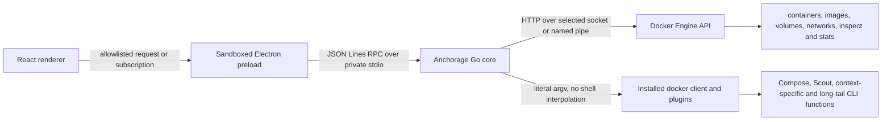

# Anchorage architecture

Anchorage is a desktop client for the exact Docker installation selected by the
user. It is not a second container runtime and it must not silently implement a
smaller, Anchorage-specific subset of Docker.

## Product boundary

The product has two equally important contracts:

1. The renderer covers every canonical Anchorage handoff state at its
   1600 x 1000 application viewport inside the handoff's 1656 x 1056 canvas.
   Reviewed visual conformance requires all 24 states, exact capture dimensions,
   per-state normalized MAE at or below 2%, and hash-bound paired review; it
   does not claim zero pixel difference. This fixed geometry belongs only to
   `?capture=...` URLs. Normal browser and Electron surfaces fill the current
   viewport and resize with it.
2. Every recursively discovered canonical advertised leaf has a literal-argv
   pipes/PTY route through Anchorage, including advertised plugin and
   context-specific paths. Hidden commands and aliases are not inventory rows,
   and transport coverage is not per-command behavioral conformance; known
   literal argv can still be delegated directly to the installed client.

Live visual workflows cover containers (including create, pause/unpause, kill,
and force removal), images, volumes, networks, `system prune`, logs, inspect,
exec, and stats. Docker-Desktop-only concepts that are not exposed by the
installed Engine or CLI are shown as explicitly unavailable in host mode and
route to the universal command surface where a relevant installed command
exists. A missing bespoke workflow must never make an installed Docker command
unreachable.

Settings follows the same rule, and is where it is easiest to break. Docker
Desktop's Settings screen configures a virtual machine: CPU and memory
allocation, a bundled Kubernetes cluster, an in-app updater. None of that exists
for a daemon running natively on the host, so in host mode those panes report
the host's own facts and state plainly what does not apply, rather than offering
a control that changes local state and reports success. Appearance is the one
pane that is genuinely a preference, and it stays interactive. The Docker Engine
pane reports what the connected daemon reports - version, storage driver, root
directory, live restore, warnings - and Anchorage does not write `daemon.json`;
editing it is a daemon configuration change and a restart, not an application
setting. The fixture panes remain for the design mock, which is now the only
place they are reachable, and the host-candidate gate asserts that no settings
tab in host mode offers a control that cannot reach the engine.

## Runtime topology



### Renderer

- React and TypeScript own presentation and view state.
- Ordinary URLs size the desk and application shell to the renderer viewport
  with no decorative outer desk or document overflow. Electron starts with a
  1600 x 1000 content area, supports resizing down to 1080 x 700, and uses
  content dimensions rather than frame-inclusive dimensions.
- Live Docker data is consumed through context-pinned snapshots, a `docker events`
  subscription that drives on-demand reconciliation, and bounded visibility-aware
  polling as a safety net behind it.
- The selected Docker context is user-switchable. Switching clears every
  per-context cache before reconnecting, so one daemon's resources can never be
  displayed under another's name.
- Large lists are virtualized and keyed by immutable Docker IDs.
- Logs, exec, image-pull output, and Command Center output use acknowledged
  sessions. Container stats are bounded one-shot samples.
- The renderer cannot access Node.js, the filesystem, child processes, or the
  Docker socket directly.

### Window and appearance system

The shipped Linux window uses Anchorage's own titlebar instead of GTK window
chrome:

- Electron creates a frameless BrowserWindow with `frame: false`, removing the
  GTK titlebar while retaining the small platform shadow and extended native
  boundary needed for edge resizing. CSS drag regions do not provide a
  supported replacement for native resize handles.
- The Anchorage titlebar is the draggable region. Search, Settings, and window
  controls are explicitly non-draggable and send allowlisted requests through
  the preload to the main process.
- The renderer synchronizes the BrowserWindow background colour to the active
  semantic application background. Resizing therefore expands the application
  surface rather than exposing a separate native backing colour.

Appearance is the product of three independent choices:

- family: Nous, Docker, GitHub, Monochrome, or Magnetic;
- mode: Light or Dark;
- corners: Rounded or Square.

All ten family-and-mode combinations implement the same semantic CSS-token
contract, and corners is a blanket override on top of any of them. The
renderer selects a palette with `data-theme` and `data-color-mode`, a shape with
`data-corners`, and sets the native `color-scheme` for browser-provided
controls. The versioned `anchorage.appearance.v1` preference is strictly
validated before use. Invalid or missing data — including a family that was
once selectable and has since been retired — falls back to Docker/Dark. If
local storage cannot be read or written, changes still apply to the in-memory
renderer state for that session and Settings reports the session-only status.

Any URL containing the `capture` query parameter deliberately takes a separate
path: it uses the fixed 1656 x 1056 canvas with a 28px desk around the
1600 x 1000 shell, forces the shipped default without reading or writing the
stored preference, and removes the Appearance navigation row. This keeps the
source-defined handoff states stable while normal runtime remains resizable.

### Electron boundary

- `nodeIntegration` is disabled.
- `contextIsolation` and renderer sandboxing are enabled.
- The preload exposes a frozen, small, method-allowlisted bridge.
- Navigation, new-window creation, permissions, downloads, and external links
  are denied unless explicitly handled.
- Desktop window controls are requests to the main process, never direct native
  access from page code.

### Go core

The Go process is the single authority for Docker access. It provides:

- direct Engine API calls for latency-sensitive structured operations;
- exact `docker` argv execution that delegates CLI-routed behavior to the
  fingerprinted installed client;
- recursive discovery of canonical advertised built-in and plugin paths from
  recognized help sections, plus versions, Usage lines, and current-context
  availability;
- cancellation, deadlines, bounded buffers, backpressure, and structured
  errors;
- ordered operation/session notifications that tell the UI when authoritative
  reconciliation is required.

Direct Engine calls are an optimization, not a competing interpretation of
Docker semantics. Where behavior differs or is not represented by the Engine
API, the installed CLI is authoritative.

#### Bulk transfers do not cross the RPC

`images.action` with `save`/`load`, and `containers.export`, are the operations
whose payload is arbitrarily large: a saved image is routinely gigabytes. They
are therefore not request/response at all. The core starts a session running
`docker image save --output <path>` (or `--input`, or `export --output`) and
returns only the session handle; Docker writes the file itself, and only
progress and the exit status travel over the JSON transport. The renderer
follows them through the same `session.*` contract as image pull, so
cancellation and output acknowledgement are shared rather than reimplemented.

The archive path is untrusted input that becomes an argv element next to a
Docker flag, so every boundary — the JSON schema, both Electron validators, and
the core — independently requires it to be absolute, free of control
characters, and not to begin with `-`. The core additionally resolves the
parent directory through the working-directory allowlist. Note that the desktop
launches the core with `--allow-cwd /`, so in the shipped configuration that
last check confirms the parent resolves rather than confining it; the operating
system is what bounds where the file can land, exactly as it does for
`docker save -o`.

## Capability fabric

Each capability has a stable identifier and evidence:

```text
id
command path
transport: engine | cli | plugin
availability: available | unavailable | degraded
reason
Docker client and server versions
API version and selected context
discovered Usage text and help hash
shared pipes and PTY transport coverage
implementation route
transport evidence
```

The inventory proves that a leaf is installed and reachable through the shared
transport. It does not infer command-specific flags, environment variables,
TTY requirements, or behavior, and it does not mass-execute arbitrary
commands. The UI must not present transport coverage as per-command
conformance.

## Universal command surface

First-class screens cover daily workflows. The command surface covers the
recursively discovered canonical advertised command graph:

- searchable command and subcommand palette;
- editable literal argument rows and environment entries;
- literal argument preview before execution;
- a default pinned target mode that injects the selected context and rejects
  Docker target/config/TLS overrides;
- an explicit literal target mode that permits Docker's own
  context/host/config/TLS globals and Docker target environment while keeping
  the fingerprinted executable fixed;
- stdin, stdout, stderr, cancellation, signals, and interactive TTY sessions;
- current context and environment shown before execution;
- copyable equivalent CLI command;
- bounded in-memory history that excludes detected secret-bearing entries.

No request is evaluated through a shell string. The core receives an argument
array and starts the discovered Docker executable directly. On the current
Linux target, the core process itself starts in the canonical current-user
home, while its `--allow-cwd /` policy permits Compose, plugin, and project
commands from any existing directory the same user can already traverse. This
does not grant additional operating-system permissions or elevate privilege:
ordinary Linux ownership, mode, ACL, and mount permissions remain authoritative.

## Performance model

- Fetch summaries before details.
- Resolve the context endpoint and the Engine HTTP client once per context and
  reuse them. Re-resolving per request re-forks `docker context inspect`, rebuilds
  the transport and re-negotiates the API version, which measured as the majority
  of a warm list call.
- Treat `/system/df` as opt-in. It is a full daemon-side disk walk and only the
  dashboard displays it.
- Cache the recursive command inventory against the Docker binary's SHA-256. The
  walk spawns roughly one help subprocess per advertised command node.
- Subscribe to `docker events` and reconcile the affected domain on demand,
  coalescing bursts. Poll the container list every two seconds and image, volume
  and network lists every ten seconds only while their views are visible, as a
  backstop rather than the primary freshness mechanism.
- Suppress overlapping requests and discard stale stats samples.
- Apply bounded ring buffers to logs and command output.
- Batch high-frequency samples to the renderer at a display-friendly cadence.
- Virtualize lists and avoid rerendering unchanged rows.
- Keep Docker I/O, parsing, and compression outside the renderer process.

## Correctness model

- Preserve Docker IDs as identity; names are labels.
- Carry the selected context through discovery and every operation.
- Never infer command success from process start: use exit status plus
  operation-specific verification.
- Treat unknown image/volume usage as unknown, never as zero or unused.
- Remove an image tag only after resolving that reference and verifying it
  still names the requested immutable image ID. Removal by immutable ID needs no
  such check and is the path for untagged images, which have no reference at all.
- Require explicit consent for `--force` rather than escalating silently, and
  state why a destructive control is unavailable rather than only disabling it.
- Keep dangling-image cleanup distinct from all-unused-image cleanup, and
  preserve Docker's named-volume `--all` semantics.
- Treat operation notifications as invalidation hints, then reconcile state.
- Make destructive target IDs and context visible and require confirmation.
- Return structured errors while retaining exact stderr for diagnosis.
- Test direct-API operations against their CLI equivalents on disposable
  resources.
